Counting things
====================================
1. Youtube views  
2. Monitoring System  
3. Analyse data in real time: fraud, recommendation, trending  
 
Requirements clarification
====================================
1. Users/ Customers:
    Who will use the system?
    How the system will be used?
2. Scale (read and write)
    How many read queries per second?
    How much data is queried per request?
    How many video views are processed per second?
    Can there be spikes in traffic?
3. Performance
    What is expected write-to-read data delay?
    What is expected p99 latency for read queries?
4. Cost (Budget)
    Should the design minimize the cost of development?
    Should the design minimize the cost of maintenance?

Functional Requirements - API
====================================  
The system has to count video view events.  
-> countViewEventr(videoId)  
-> countEvent(videoId, eventType) ("like", "view", "share")  
-> processEvent(videoId, eventType, function) ("sum", "count", "average")  
-> processEvents(listOfEvents)   

The system has to return video views count for a time period.  
-> getViewsCount(videoId, startTime, endTime)  
-> getCount(videoId, eventType, startTime, endTime)  
-> getStats(videoId, eventType, function, startTime, endTime)  

Non functional Requirements
====================================
Primary concerns:  
* Scalable (tens of thousands of video views per second)  
* Highly Performant (few tens of milliseconds to return total views count for a video)  
* Highly Available (survives hardware/network failures, no single point of failure)  
----------------------------------------
* Consistency (CAP theorem: choose Availability or Consistency)  
* Cost (hardware, development, maintenance)  

Start with the data. What we store?  
====================================  
Individual events (every click)  
videoId | Timestamp | ...

Pros:
* Fast writes
* Can slice and dice data however we need
* Can recalculate numbers if needed
Cons:
* Slow reads (need to aggregate every request)
* Costly for a large scale (many events)
-------------------------------------------------------------------------
Aggregate data (e.g. per minute) in real time  
videoId | Timestamp | Count

Pros:
* Fast reads
* Data is ready for decision making
Cons:
* Can query only the way data was aggregated
* Requires data aggregation pipeline
* Hard or event impossible to fix errors

Where we store?
====================================
How to scale writes?
How to scale reads?
How to make both writes and read fast?
How not to lose data in case of hardware faults and network partitions?
How to achieve strong consistency? What are the tradeoffs?
How to recover data in case of an outage?
How to ensure data security?
How to make it extensible for data model changes in the future?
Where to run (cloud vs on-premises data centers)?
How much money will it all cost?

SQL database
====================================
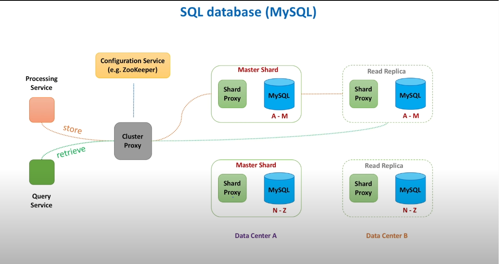

NoSQL database
====================================
Coordination node takes initial request and makes:
* Quorum read
* Quorum write  
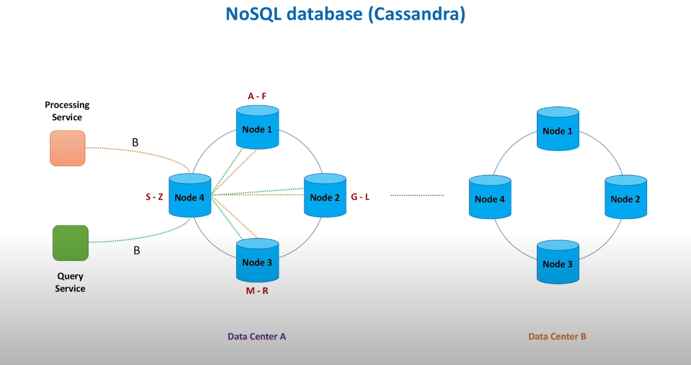

How we store?
====================================
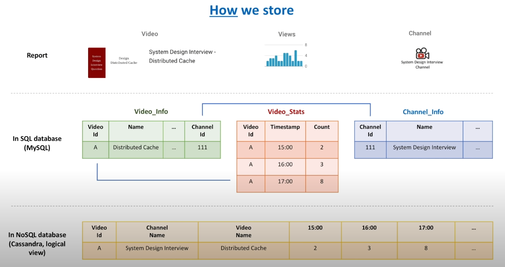

Processing service
====================================
* How to scale?
* How to achieve high throughput?
* How not to lose data when processing node crashes?
* What to do when database is unavailable or slow?
====================================
* Scalable = Partitioning
* Reliable = Replication and checkpointing
* Fast = In-memory

Data aggregation basics:
====================================
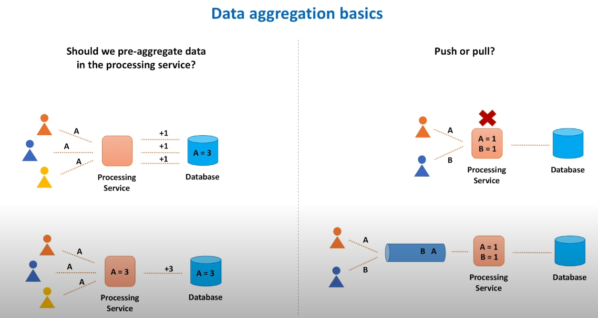
====================================
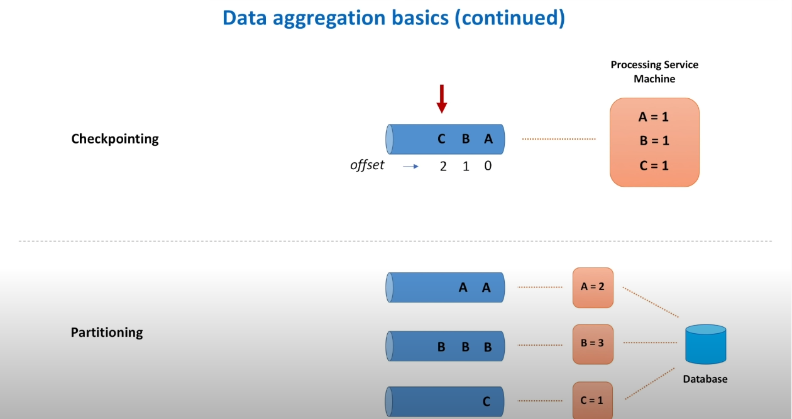

Processing service (detailed design):
====================================
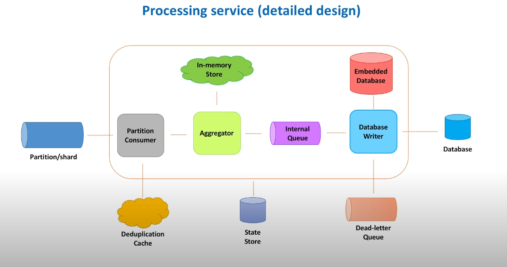

Ingestion path components
====================================
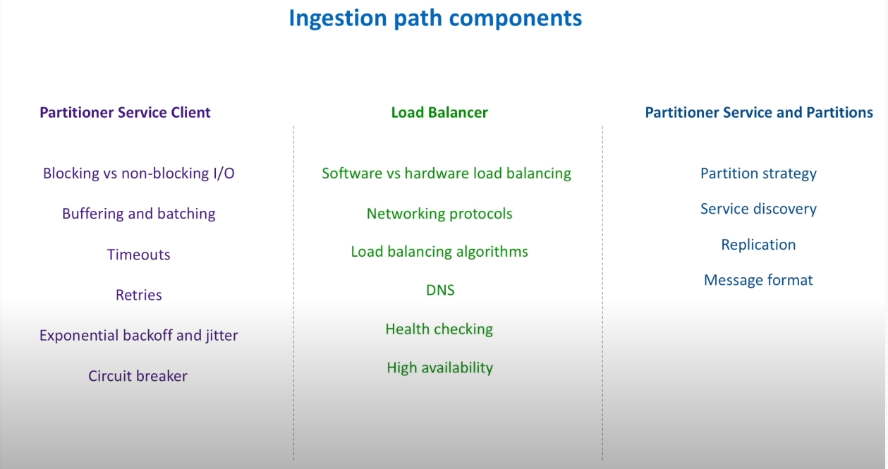

Data retrieval
====================================
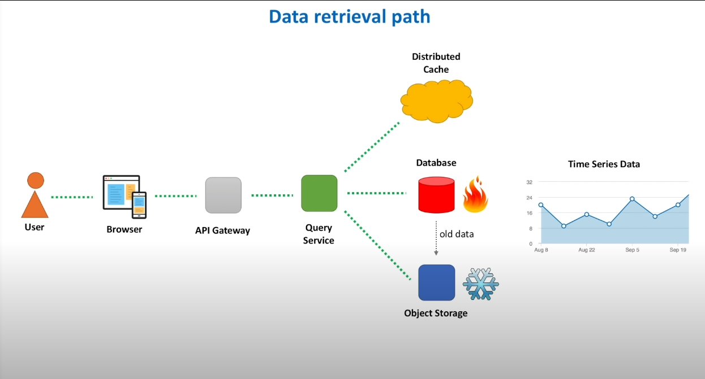

Data flow simulation
====================================
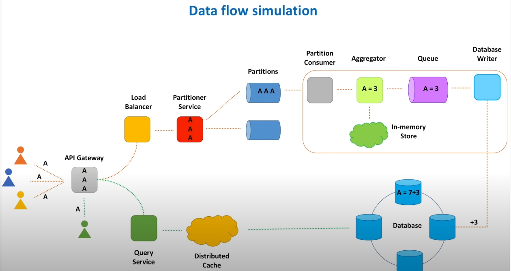

Technology stack
====================================
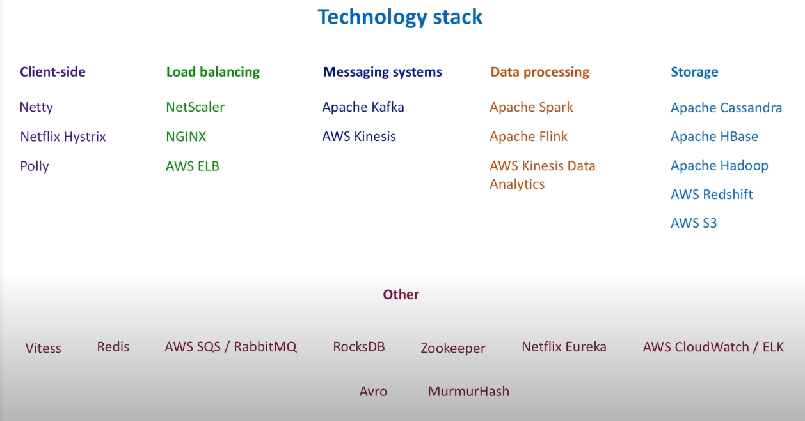

Bottlenecks identification
====================================
1. Load testing: test system 2-3x higher load than average prod load.
2. Stress testing: beyound prod load, to find which component fails first: CPU, memory, disk i/o, network
3. Soak testing: testing system in prod load to identify leaks.
Ex: Apache JMeter  

System health
====================================
Metrics with dashboard, alerts.  
4 golden signals of monitoring:  
1. latency
2. traffic
3. error
4. saturation

How to assure accurate results?
====================================
Audit system.  
1. Weak audit test: continuesly running e2e test, checking if service returning excepting count.
2. Strong audit test: calculates events with different path, save in hadoop, make map-reduce and compare results.

How to handle hugely popular videos? (Heavy hitters)
====================================
1. Add for example time to videoId to generate different hashes and spread load 
2. Partitioning
3. Add more nodes in consistent hashing ring

Summary
====================================
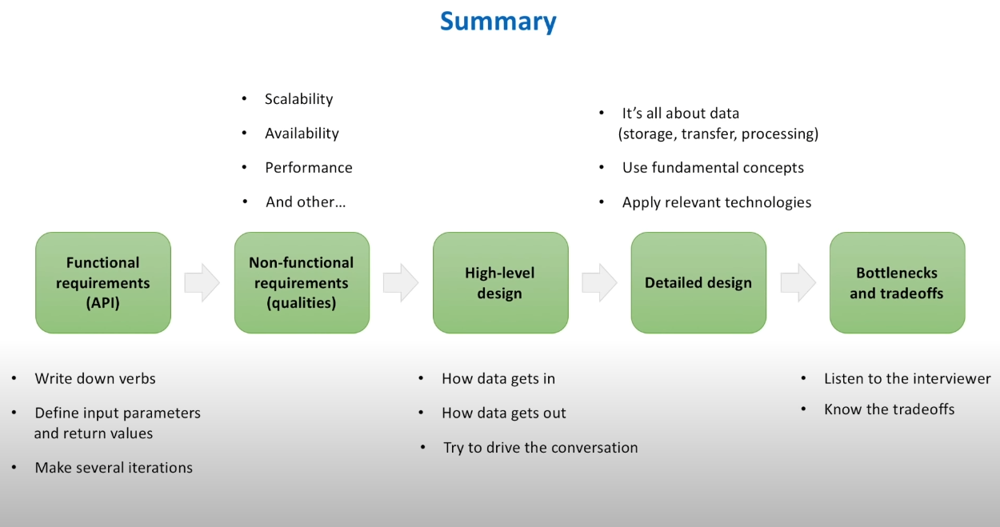

Top K heavy hitters
====================================
1. Number of likes on youtube video on the last 1 minute/hour/day
2. Youtube trends, popular products, volatile stocks
3. DDOS attack prevention 
